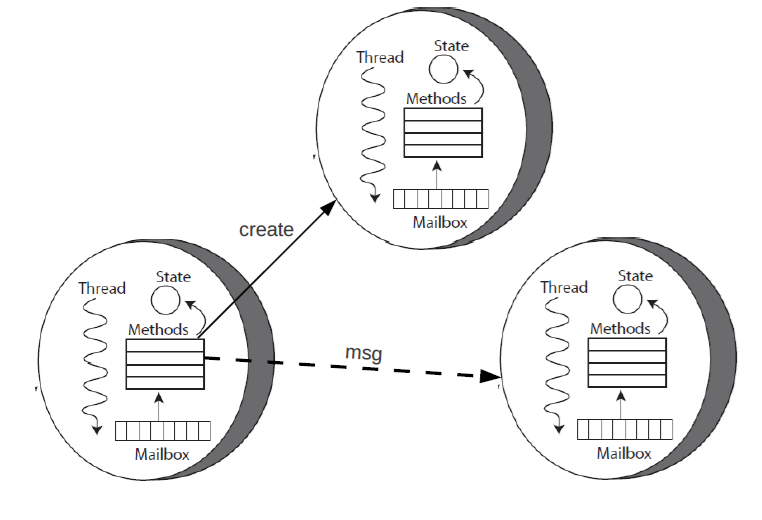
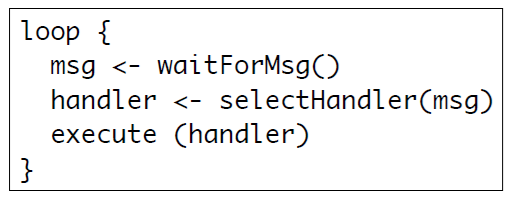
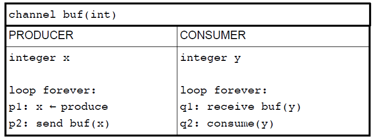

# ACTORS
- Entità reattive che comunicano tra loro tramite scambio di **messaggi asincroni**.
- Portano la concorrenza nel paradigma OOP.
- Su un hardware fisico si può avere un numero arbitrario di attori, indipendentemente dal numero di threads fisici supportati.

## Caratteristiche
  - **Stato** (_incapsulato_, un attore non può accedere allo stato degli altri)
  - **Comportamento reattivo** (esegue azioni solo quando riceve messaggi) (azioni rappresentate da `handler`)
  - **Flusso di controllo**
  - **Coda di messaggi in arrivo**
- Possono comunicare <=> conoscono i rispettivi identificatori.
- Vengono **evitate le corse critiche**.

## Primitive
- `send` invia un messaggio in modo asincrono. Ha successo quando il messaggio viene inviato. Vengono fornite garanzie sull'effettiva consegna, ma non sulle tempistiche.
- `create` crea un attore con un certo comportamento.
- `become` cambia il comportamente di un attore, in base alla propria storia.
- **NON esiste** una primitiva `receive`

## Vantaggi
- **Fairness** nell'invio e gestione dei _messaggi_.
- **Trasparenza** sulla _posizione_ degli attori (è importante conoscere gli identificatori, non le posizioni)



## Schemi e idiomi ricorrenti
- **Futures**
- **Serializator**
- **Fork-Join**
- **Channel adapter**
- **Request-Reply**
- **Message Broker**

## Framework comuni
- **Actor Foundry** (Java): uso di `send` e `create`, attori con annotazioni `@message`.
- **Akka** (Java/Scala): `receive` con logging, attori non tipati.
- **Erlang**: (funzionale): attori come processi

## Handler e Event loop 


- Ogni `handler` è eseguito completamente prima di ricevere un nuovo messaggio.
- Ogni `handler` dovrebbe avere un comportamento non-bloccante. Il "punto di blocco" è gestito dall'**event loop**.
- Complicato programmare in questo modo.

## Problemi
- **Asynchronous spaghetti**: flusso logico frammentato in tanti handlers e callback.
- **Pro-attività**:  difficile modellare attore con comportamento pro-attivo (ovvero che possa eseguire azioni senza stimolo esterno). 
- **Message ordering**: impossibile prevedere ordine di arrivo dei messaggi e possibile **volontà di non gestire subito un messaggio**.

## Soluzione alla pro-attività
- **Suddivisione singolo attore** in molteplici attori comunicanti tra loro.
- **Message self-sending**.

## Soluzione al message ordering
Offerta da **Akka**, consiste in un meccanismo di **stashing** il quale utilizza le primitive:
- `stash` per archiviare messaggi in arrivo.
- `unstash` per riportare in coda i messaggi archiviati e utilizzarli.

<br><br><br><br><br><br><br><br><br>

# MESSAGE PASSING MODELS
## Idea di base
- Modello sempre più utilizzato **in ambito di programmazione distribuita ma anche concorrente**, perchè evita problemi come la gestione della mutua esclusione<br>
- Scambio di messaggi tra processi **tramite funzioni primitive**, **senza lock, monitor e semafori**.<br>

## Primitive
  - `chan ch (type id1, type id2, ...)` canale avente tipi e identificatori dei vari campi trasmessi (accesso al canale è operazione atomica).<br>Schemi/modelli di comunicazione:
      - **one-to-one**: canale utilizzabile solo da coppia di processi.
      - **many-to-many**: canale utilizzabile da tot mittenti e tot destinatari.
        - competizione in ricezione
        - non determinismo
      - **many-to-one**: vengono impiegate delle porte, con tot mittenti e singolo destinatario.
  - `send ch (expr1, expr2, ...)` invia messaggio composto da espressioni sul canale (tipi delle espressioni devono essere uguali ai tipi dei campi).
  - `receive ch (var1, var2, ...)` riceve messaggio sul canale (tipi delle variabili devono essere uguali ai tipi dei campi).

## Tipo di comunicazione utilizzabile
- **Sincrona**
  - Invio di messaggio => bloccante, finchè messaggio non viene ricevuto.
  - Ricezione di messaggio => bloccante, finchè non presente nuovo messaggio sul canale.
  - Go Lang utilizza questo tipo di comunicazione.
  - **Rendez-vous**: estensione della sincronizzazione, mittente aspetta sia che il destinatario riceva il messaggio, sia che risponda.
- **Asincrona**
  - Code FIFO utilizzate per i canali.
    - Invio ha successo <=> messaggio aggiunto alla coda
    - Ricezione bloccata finchè non presente nuovo messaggio sul canale.

## Produttori-Consumatori con asincronia


<br><br><br>

## Guards 
Utilizzate nella comunicazione sincrona o asincrona per risolvere il problema di ricezione messaggi da più canali contemporaneamente. Si basa sulla **ricezione selettiva**.<br>
`B; C → S`<br>
ossia<br>
`(Boolean); (Communication statement) → (Statement block)`

## Guards con if
```
if B1; C1 → S1;
[] B2; C2 → S2;
[] B3; C3 → S3;
fi
```

Ad esempio:<br>
```
if nReqs < max; receive computeSum(a,b,i) → nReqs+=1; send result[i](a+b)
[] nReqs < max; receive computeMul(a,b,i) → nReqs+=1; send result[i](a*b)
fi
```

## Guards con cicli do
```
do B1; C1 → S1;
[] B2; C2 → S2;
[] B3; C3 → S3;
od
```

Il ciclo viene ripetuto finchè non guardia non cede. Ad esempio:<br>
```
char buffer[10];
int front = 0, rear = 0, count = 0;

do count < 10; receive in(buffer[rear]) → count++; rear = (rear+1)%10;
[] count > 0; send out(buffer[front]) → count--; front = (front+1)%10;
od
```

## Interazione 
L'interazione che avviene per lo scambio di messaggi è **peer-to-peer**. Solitamente le informazioni e le resposabilità vengono **decentralizzate** tra i vari partecipanti, i quali eseguono tutti lo stesso codice ed alcuni di loro assumono il **ruolo di coordinatore**.

## Modelli di interazione
- **Centralizzato**: unico coordinatore che gestisce informazioni provenienti da diversi partecipanti.
  - _PRO_: numero di messaggi contenuto.
  - _CONTRO_: collo di bottiglia, ricezione del coordinatore ritardata.
- **Simmetrico**: ogni partecipante esegue le stesse funzioni inviando inizialmente i propri dati a tutti gli altri partecipanti
  - _PRO_: alta concorrenza.
  - _CONTRO_: gran numero di messaggi.
- **Ad anello**: ogni partecipante comunica solo col predecessore e col successore, creando appunto un anello.
  - _PRO_: numero di messaggi contenuto.
  - _CONTRO_: concorrenza limitata.