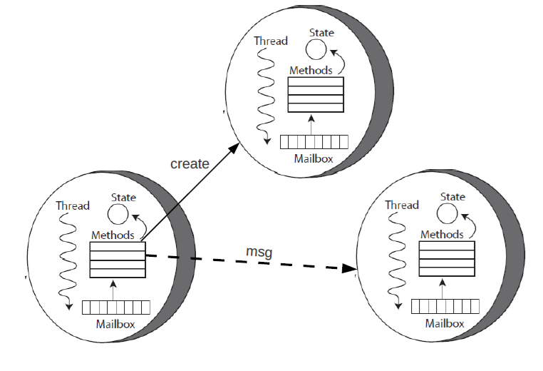
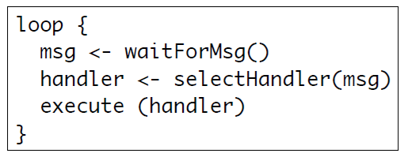

# ACTORS
- Entità reattive che comunicano tra loro tramite scambio di **messaggi asincroni**.
- Portano la concorrenza nel paradigma OOP.
- Su un hardware fisico si può avere un numero arbitrario di attori, indipendentemente dal numero di threads fisici supportati.

## Caratteristiche
  - **stato** (_incapsulato_, un attore non può accedere allo stato degli altri)
  - **comportamento reattivo** (esegue azioni solo quando riceve messaggi) (azioni rappresentate da `handler`)
  - **flusso di controllo**
  - **coda di messaggi in arrivo**
- Possono comunicare <=> conoscono i rispettivi identificatori.
- Vengono **evitate le corse critiche**.

## Primitive
- `send` invia un messaggio in modo asincrono. Ha successo quando il messaggio viene inviato. Vengono fornite garanzie sull'effettiva consegna, ma non sulle tempistiche.
- `create` crea un attore con un certo comportamento.
- `become` cambia il comportamente di un attore, in base alla propria storia.
- **NON esiste** una primitiva `receive`

## Vantaggi
- **Fairness** nell'invio e gestione dei _messaggi_.
- **Trasparenza** sulla _posizione_ degli attori (è importante conoscere gli identificatori, non le posizioni)

## Schemi e idiomi ricorrenti
- **Futures**
- **Serializator**
- **Fork-Join**
- **Channel adapter**
- **Request-Reply**
- **Message Broker**

## Framework comuni
- **Actor Foundry** (Java): uso di `send` e `create`, attori con annotazioni `@message`.
- **Akka** (Java/Scala): `receive` con logging, attori non tipati.
- **Erlang**: (funzionale): attori come processi

## Handler e Event loop 

- Ogni `handler` è eseguito completamente prima di ricevere un nuovo messaggio.
- Ogni `handler` dovrebbe avere un comportamento non-bloccante. Il "punto di blocco" è gestito dall'**event loop**.
- Complicato programmare in questo modo.

## Problemi
- **Asynchronous spaghetti**: flusso logico frammentato in tanti handlers e callback.
- **Pro-attività**:  difficile modellare attore con comportamento pro-attivo (ovvero che possa eseguire azioni senza stimolo esterno). 
- **Message ordering**: impossibile prevedere ordine di arrivo dei messaggi e possibile **volontà di non gestire subito un messaggio**.

## Soluzione alla pro-attività
- **Suddivisione singolo attore** in molteplici attori comunicanti tra loro.
- **Message self-sending**.

## Soluzione al message ordering
Offerta da **Akka**, consiste in un meccanismo di **stashing** il quale utilizza le primitive:
- `stash` per archiviare messaggi in arrivo.
- `unstash` per riportare in coda i messaggi archiviati e utilizzarli.

